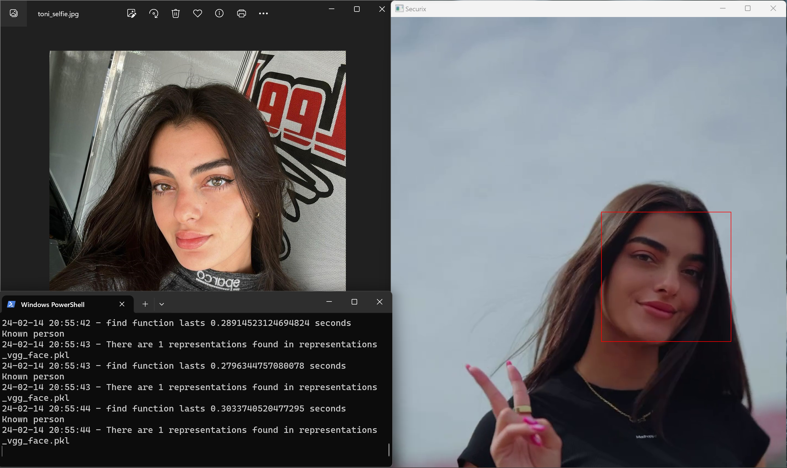
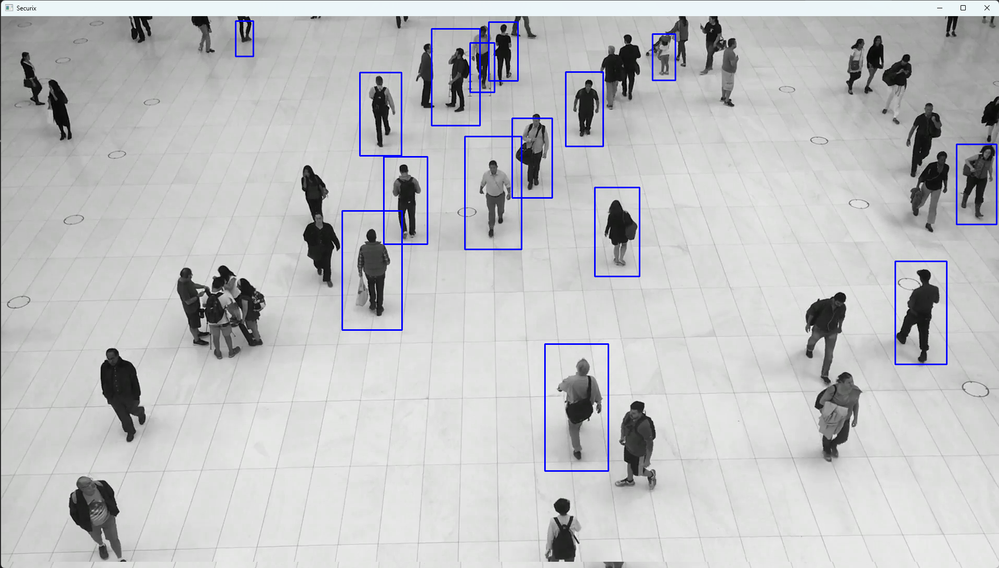

# Securix

> Face recognition script. Also can recognize body shape. Compare recognized face to known persons. Can be used for doorbell camera. Can be used both on video and live camera


## 🖼️ Screenshots

 
 

## 📦 Installation

1. Install Python 3.9.11
2. Install libraries from `requirements.txt`:
    ```bash
    pip install -r requirements.txt
    ```
    If there is an error, try installing the `deepface` library without dependencies:
    ```bash
    pip install --no-deps deepface
    ```

## Usage

1. Load your face to the folder `/users`.
2. Run the program:
    ```bash
    python securix.py
    ```
    - If you want to work with video, change `"foot.mp4"` to your file path.
    - If you want to work with a webcam:
        ```python
        camera = cv2.VideoCapture(0)
        ```
