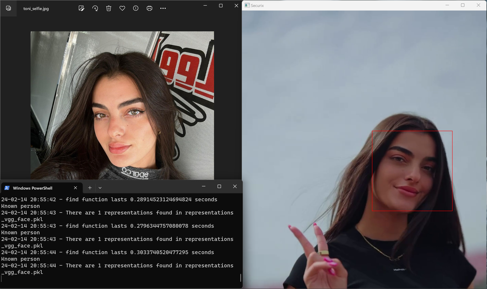
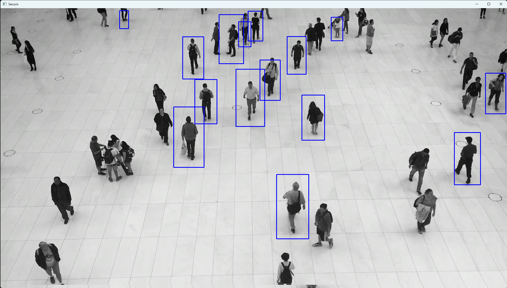

# Securix

> Securix is a Python-based facial and body recognition tool designed for security applications like smart doorbell cameras. It processes both live webcam feeds and pre-recorded video, comparing detected faces against a database of known users


## 🖼️ Screenshots




## 📦 Installation

1. Install Python 3.9.11
2. Install libraries from `requirements.txt`:
    ```bash
    pip install -r requirements.txt
    ```
    If there is an error, try installing the `deepface` library without dependencies:
    ```bash
    pip install --no-deps deepface
    ```

## 🚀 Usage

1. Place clear image files (e.g., `.jpg`, `.png`) of the people you want the system to recognize into the `users/` folder.
2. Open `securix.py` in a text editor and modify line 9 (`camera = cv2.VideoCapture(...)`):
    - To use a specific video file:
      ```python
      camera = cv2.VideoCapture("video/your_video.mp4")
      ```
    - To use your live webcam (usually ID `0`):
      ```python
      camera = cv2.VideoCapture(0)
      ```
3. Run the Script:
    ```bash
    python securix.py
    ```
